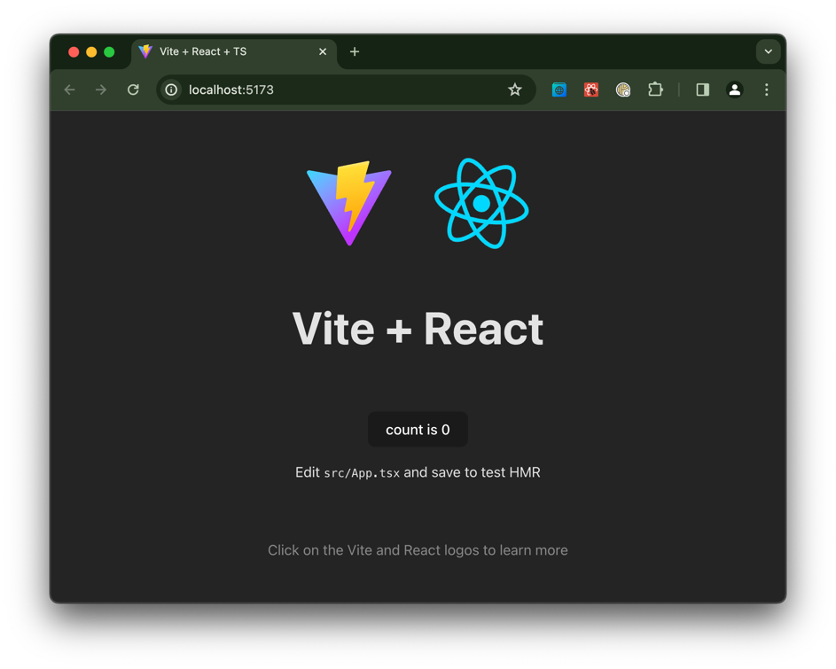
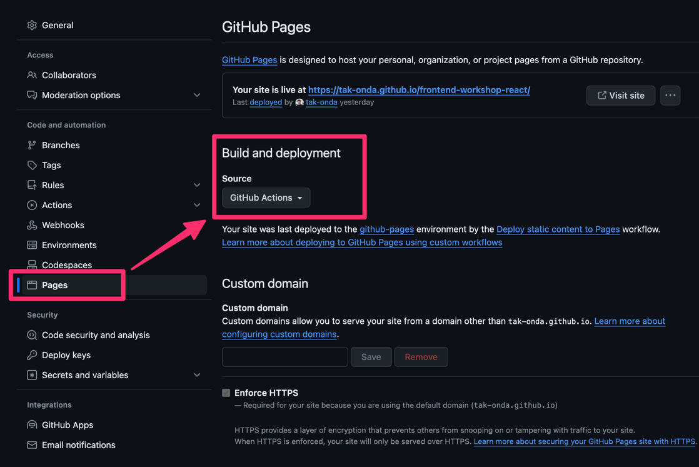
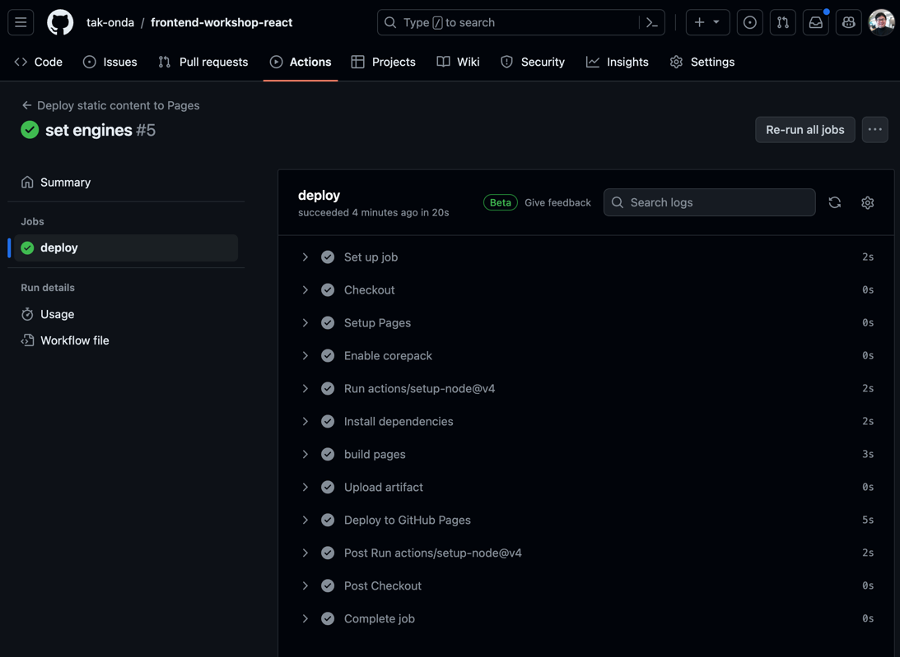
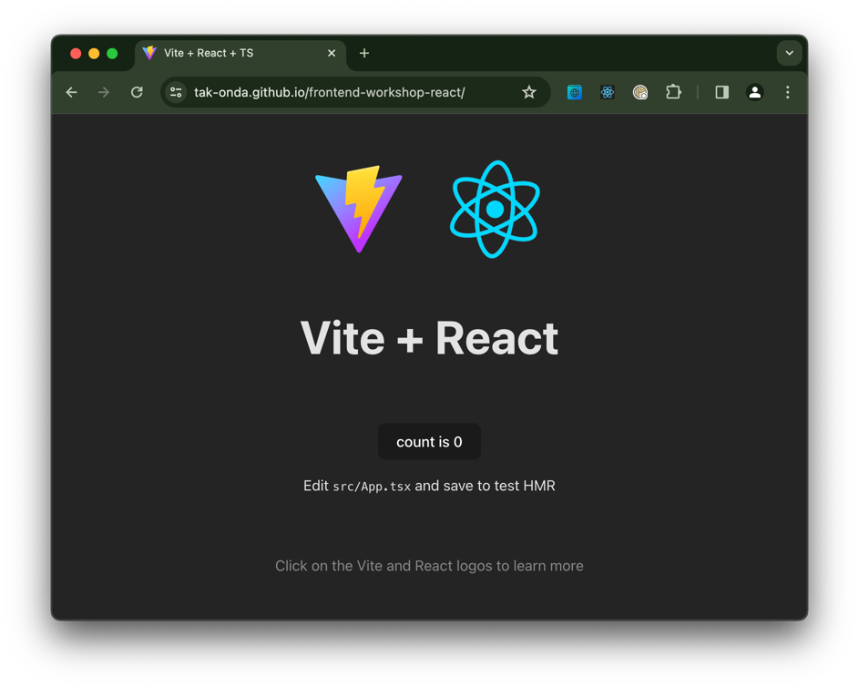

# フロントエンド入門ワークショップ React 編

## 目的

TODO アプリ作成を通じて、React フロントエンド開発の感覚を掴んでもらうことを目的としています。

- React に触れてみる
- GitHub Pages で作ったアプリを公開する
- ライブコーディングしながら TODO アプリを作れるようになる

時間が限られているので、以下については触れません

- 通信
- CSS
- メモ化
- フロントエンドルーティング (SPA 遷移)

時間的に余裕があれば、プロダクションレベルのコードの書き方についても紹介したいと思います。


## 前準備

### 環境

本ワークショップは WSL2 または macOS 環境を前提とします

### Node.js のインストール

直接インストールしてもよいですが、これを機に [mise](https://mise.jdx.dev/getting-started.html) のようなバージョンマネージャーを導入することをお勧めします。

Node.js 最新 LTS の 20.x 系が使えることを確認してください。

```shell
$ node -v
v20.11.1
```

パッケージマネージャーは pnpm を利用します。
(様々なプロジェクトで pnpm を利用しているため)

```shell
$ corepack enable pnpm
```


## プロジェクトの作成

```shell
$ pnpm create vite frontend-workshop-react --template react-ts
../Library/pnpm/store/v3/tmp/dlx-13453   |   +1 +
../Library/pnpm/store/v3/tmp/dlx-13453   | Progress: resolved 1, reused 1, downloaded 0, added 1, done

Scaffolding project in /Users/ondat/workspace/frontend-workshop-react...

Done. Now run:

  cd frontend-workshop-react
  pnpm install
  pnpm run dev

$ cd frontend-workshop-react

$ pnpm install
Downloading registry.npmjs.org/typescript/5.4.3: 5.82 MB/5.82 MB, done
Packages: +211
++++++++++++++++++++++++++++++++++++++++++++++++++++++++++++++++++++++++++++++++++++++++++++++++++++++++++++++++++++++++++++++++++++++++++++++++++++++++++++++++++++++++++++++++++
Progress: resolved 245, reused 175, downloaded 36, added 211, done
node_modules/.pnpm/esbuild@0.20.2/node_modules/esbuild: Running postinstall script, done in 231ms

dependencies:
+ react 18.2.0
+ react-dom 18.2.0

devDependencies:
+ @types/react 18.2.69
+ @types/react-dom 18.2.22
+ @typescript-eslint/eslint-plugin 7.3.1
+ @typescript-eslint/parser 7.3.1
+ @vitejs/plugin-react 4.2.1
+ eslint 8.57.0
+ eslint-plugin-react-hooks 4.6.0
+ eslint-plugin-react-refresh 0.4.6
+ typescript 5.4.3
+ vite 5.2.6

Done in 18.6s
```

pnpm を最新にアップデート

```shell
$ corepack use pnpm@latest
Installing pnpm@8.15.5 in the project...

Lockfile is up to date, resolution step is skipped
Already up to date
Done in 574ms
```

dev モードで起動して動作確認を行います。

```shell
$ pnpm dev

  VITE v5.2.6  ready in 113 ms

  ➜  Local:   http://localhost:5173/
  ➜  Network: use --host to expose
  ➜  press h + enter to show help
```  

ブラウザで `http://localhost:5173/` を開いて、以下の画面が表示されれば成功です。




## リポジトリの作成

GitHub Pages を利用したいので、個人アカウントで public repository を作成してください。

```shell
$ git init
$ git add .
$ git commit -m 'initial commit'
[main (root-commit) e55d64b] initial commit
 17 files changed, 2325 insertions(+)
 create mode 100644 .eslintrc.cjs
 create mode 100644 .gitignore
 create mode 100644 README.md
 create mode 100644 img.png
 create mode 100644 index.html
 create mode 100644 package.json
 create mode 100644 pnpm-lock.yaml
 create mode 100644 public/vite.svg
 create mode 100644 src/App.css
 create mode 100644 src/App.tsx
 create mode 100644 src/assets/react.svg
 create mode 100644 src/index.css
 create mode 100644 src/main.tsx
 create mode 100644 src/vite-env.d.ts
 create mode 100644 tsconfig.json
 create mode 100644 tsconfig.node.json
 create mode 100644 vite.config.ts
 
$ git branch -M main

$ git remote add origin https://github.com/tak-onda/frontend-workshop-react.git

$ git push -u origin main
Enumerating objects: 22, done.
Counting objects: 100% (22/22), done.
Delta compression using up to 10 threads
Compressing objects: 100% (19/19), done.
Writing objects: 100% (22/22), 141.16 KiB | 20.17 MiB/s, done.
Total 22 (delta 0), reused 0 (delta 0), pack-reused 0 (from 0)
To https://github.com/tak-onda/frontend-workshop-react.git
 * [new branch]      main -> main
branch 'main' set up to track 'origin/main'.
```


## デプロイ

GitHub Pages にデプロイするために、以下の手順で設定を行います。

### Pages の有効化

GitHub のリポジトリ設定から Pages を有効化します。

`https://github.com/<account>/<repository>/settings/pages`



Build and Deployment で GitHub Actions を選択してください。


### `vite.config.ts` の設定

`base` に作成したリポジトリ名を `/<repository-name>/` として指定してください

```typescript
import { defineConfig } from 'vite'
import react from '@vitejs/plugin-react'

// https://vitejs.dev/config/
export default defineConfig({
    plugins: [react()],
    base: '/frontend-workshop-react/'
})
```

### `package.json` の設定

GitHub Actions で Node.js および pnpm のバージョンを特定できるように `engines` 部分を追記します。

```json
    "typescript": "^5.4.3",
    "vite": "^5.2.6"
  },
  "engines": {
    "node": ">=20.0",
    "pnpm": ">=8.14"
  },
  "packageManager": "pnpm@8.15.5+sha256.4b4..."
```

### GitHub Actions の設定

`.github/workflows/deploy.yaml` を作成します。

以下をそのままコピーしてください。

```yaml
name: Deploy static content to Pages

on:
  push:
    branches: ["main"]
  workflow_dispatch:

permissions:
  contents: read
  pages: write
  id-token: write

concurrency:
  group: "pages"
  cancel-in-progress: false

jobs:
  deploy:
    environment:
      name: github-pages
      url: ${{ steps.deployment.outputs.page_url }}
    runs-on: ubuntu-latest
    steps:
      - name: Checkout
        uses: actions/checkout@v4

      - name: Setup Pages
        uses: actions/configure-pages@v4

      - name: Enable corepack
        run: corepack enable

      - uses: actions/setup-node@v4
        with:
          node-version-file: 'package.json'
          cache: 'pnpm'
          cache-dependency-path: 'pnpm-lock.yaml'

      - name: Install dependencies
        run: pnpm install --frozen-lockfile

      - name: build pages
        run: pnpm build

      - name: Upload artifact
        uses: actions/upload-pages-artifact@v3
        with:
          path: './dist'

      - name: Deploy to GitHub Pages
        id: deployment
        uses: actions/deploy-pages@v4
```

### 追加したファイルを commit して push

```shell
$ git add .
$ git commit -m 'add deploy config'
$ git push
```


## 動作確認

### GitHub Actions の確認

Actions タブから deploy が走っていることを確認してください



### ブラウザで確認

`https://<username>.github.io/<repository-name>/` にアクセスして、以下の画面が表示されれば成功です。



